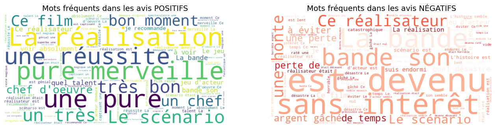

# 🎬 Ciné-Sentiment : Analyse de Critiques de Films

Ce projet est une exploration du **Traitement Automatique du Langage Naturel (NLP)**. L'objectif est de construire un modèle de Machine Learning capable de lire une critique de cinéma et de prédire si l'avis est **positif** ou **négatif**.

## 🚀 Fonctionnalités du Notebook

Le notebook (`nlp.ipynb`) suit les étapes suivantes :

1.  **Exploration des données :** Chargement et analyse préliminaire du dataset.
2.  **Pré-traitement (Preprocessing) :** Nettoyage du texte pour le rendre exploitable par la machine.
3.  **Visualisation :** Génération de **Nuages de Mots** pour comparer le vocabulaire des avis positifs et négatifs.
4.  **Vectorisation :** Transformation du texte en données numériques via `CountVectorizer`.
5.  **Modélisation :** Entraînement d'un algorithme **Naïve Bayes (MultinomialNB)**.
6.  **Prédiction :** Test du modèle sur de nouvelles phrases.

## 📦 Bibliothèques Python requises

Pour exécuter ce notebook, vous aurez besoin des bibliothèques suivantes. Vous pouvez les installer via :

```bash
pip install pandas numpy scikit-learn matplotlib seaborn wordcloud

```


*L'image ci-dessus montre la différence lexicale claire identifiée par le modèle.*

*(Une analyse critique des visualisations est incluse dans le notebook pour discuter des biais liés aux mots fréquents mais neutres comme "film" ou "scénario").*
